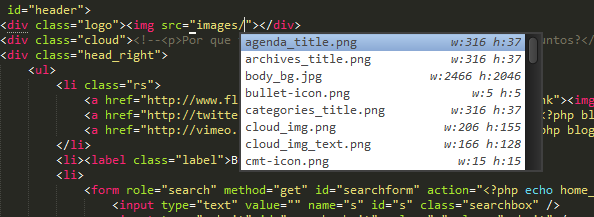
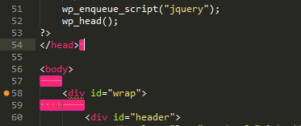

# Setting Up Sublime Text 3 #

This is not a step by step guide for anyone who starts with [Sublime Text](http://www.sublimetext.com/). These are the settings and reminders that fit in my workflow. You can choose what to install.

> If they are useful to me, may also be useful for you.

## Sublime Text ##

Download and install [Sublime Text](http://www.sublimetext.com/).

[http://www.sublimetext.com/3](http://www.sublimetext.com/3)

## Packages ##

Packages in Sublime Text are a collection of resource files used to extend functionalities, they can be: plugins, syntax highlighting, menus, snippets...

There are a lot of custom packages to install, you can install packages to your necessity or you can create you own package.

### [Package Control](https://sublime.wbond.net/) ###

Package Control manage all packages, makes it simple to find, install, remove and keep packages up-to-date.

#### Installation ####

* Open Console in the menu options `View > Show Console`

* Paste the following code and execute

<code>import urllib.request,os,hashlib; h = '2deb499853c4371624f5a07e27c334aa' + 'bf8c4e67d14fb0525ba4f89698a6d7e1'; pf = 'Package Control.sublime-package'; ipp = sublime.installed_packages_path(); urllib.request.install_opener( urllib.request.build_opener( urllib.request.ProxyHandler()) ); by = urllib.request.urlopen( 'http://packagecontrol.io/' + pf.replace(' ', '%20')).read(); dh = hashlib.sha256(by).hexdigest(); print('Error validating download (got %s instead of %s), please try manual install' % (dh, h)) if dh != h else open(os.path.join( ipp, pf), 'wb' ).write(by)</code>

#### How to use ####

Installing packages

* `ctrl` `shift` `p`
* Type `install`
* Select `Package Control: Install Package`
* Search the package you want to install

Removing packages

* `ctrl` `shift` `p`
* Type `remove`
* Select `Package Control: Remove Package`
* Find the package you want to remove

### [SideBarEnhancements](https://github.com/titoBouzout/SideBarEnhancements) ###

Provides enhancements to the operations on Sidebar of Files and Folders, like: new file/folder, edit, open/run, reveal, find in selected/parent/project, cut, copy, paste, paste in parent, rename, move, delete, refresh...

### [AutoFileName](https://github.com/BoundInCode/AutoFileName) ###

Autocomplete filenames and paths in HTML and CSS.

#### How to use ####

* In the file press `ctrl` `space`

#### Inserting markdown and stylus in the scope ####

* Copy the file [autofilename.sublime-settings](https://raw.githubusercontent.com/tiagoporto/setting-up-sublime-text/master/Packages%20Settings/autofilename.sublime-settings) in the folder `C:\Users\User Name\AppData\Roaming\Sublime Text 3\Packages\User` in windows or ` ~/Library/Application Support/Sublime Text 3` in OS X.

### [Tag](https://github.com/SublimeText/Tag) ###

Provides utilities to work with tags in HTML/XML: "Close tag on slash", "Tag indent or AutoFormat Tags", "Tag Remove", "Insert as Tag", "Tag Remove Attributes", "Tag Close", "Tag Lint"

#### How to use ####

* See the documentation: [https://github.com/SublimeText/Tag](https://github.com/SublimeText/Tag)

### [Bracket Highlighter](https://github.com/facelessuser/BracketHighlighter) ###

Find and highlight matching brackets such as: [], (), {}, "", '', <tag></tag>, and even custom brackets.

### [Trailing Spaces](https://github.com/SublimeText/TrailingSpaces)

Highlight trailing spaces and delete them in a flash!

#### Setting Trim On Save ####

* Copy the file [trailing_spaces.sublime-settings](https://raw.githubusercontent.com/tiagoporto/setting-up-sublime-text/master/Packages%20Settings/trailing_spaces.sublime-settings) in the folder `C:\Users\User Name\AppData\Roaming\Sublime Text 3\Packages\User` in windows or ` ~/Library/Application Support/Sublime Text 3` in OS X.

### [Emmet](http://emmet.io/) ###

Emmet is the most essential plugin for web-developers, they helps you write HTML and CSS code easily, expanding simple abbreviations into complex code snippets.

* Watch the demo in [http://emmet.io/](http://emmet.io/)
* Read this great tutorial: [Goodbye, Zen Coding. Hello, Emmet!](http://www.smashingmagazine.com/2013/03/26/goodbye-zen-coding-hello-emmet/)
* Learn the syntax in [Cheat Sheet](http://docs.emmet.io/cheat-sheet/)

### [Color Picker](http://weslly.github.io/ColorPicker/) ###

Open a Color Picker in Sublime Text.

#### How to use ####

* `ctrl` `shift` `c` on Windows or `command` `shift` `c` on OS X

### [ColorHighlighter](https://github.com/Monnoroch/ColorHighlighter) ###

Live Preview of color values in Stylesheets.

#### Tip ####

The key bindings that plugin, use some of the same useful standards key bindins of the Sublime Text , I usually disable them

* Menu Option `tools -> color highlighter -> Disable default keybindings`

<!--
### [DocBlockr](https://github.com/spadgos/sublime-jsdocs) ###

### [AllAutocomplete](https://github.com/alienhard/SublimeAllAutocomplete) ###

### [SFTP](http://wbond.net/sublime_packages/sftp)

### [EditorConfig](http://editorconfig.org/)

Working with Markdown

### [Markdown Preview](https://github.com/revolunet/sublimetext-markdown-preview)

### [MarkdownEditing](https://github.com/SublimeText-Markdown/MarkdownEditing) ###

### [AngularJS](https://github.com/angular-ui/AngularJS-sublime-package)

### [Jquery](https://github.com/SublimeText/jQuery)

### [Can I Use](https://github.com/Azd325/sublime-text-caniuse)

Keyboard shortcut `ctrl+alt+f`

### [GhostText](https://github.com/Cacodaimon/GhostText-for-SublimeText)

- [Extension for Chrome](https://chrome.google.com/webstore/detail/ghosttext-for-chrome/godiecgffnchndlihlpaajjcplehddca?utm_source=chrome-ntp-icon)

### [Gist](https://github.com/condemil/Gist)

### [Gulp](https://github.com/NicoSantangelo/sublime-gulp)

### [Terminal](https://github.com/wbond/sublime_terminal)

Keyboard shortcut `ctrl+alt+shift+t` to project folder

Keyboard shortcut `ctrl+shift+t` to file

## Additional Syntax Support

### [Apache Conf](https://github.com/colinta/ApacheConf.tmLanguage)

### [LESS](https://github.com/danro/LESS-sublime)

### [Robots](https://github.com/andriyko/sublime-robot-framework-assistant)

### [SASS](https://sublime.wbond.net/packages/Sass)

### [Stylus](https://github.com/billymoon/Stylus)

- [Stylus-Snippets](https://github.com/billymoon/Stylus-Snippets)

### [Laravel Blade](https://github.com/Medalink/laravel-blade)

## Snippets

ctrl+shift+alt+p

Local Folder

* Windows

`C:\Users\User Name\AppData\Roaming\Sublime Text 3\Packages\User`

[Comment Snippets](https://github.com/hachesilva/Comment-Snippets)

[JavaScript Console snippets](https://github.com/caiogondim/js-console-sublime-snippets)

[Jquery](https://sublime.wbond.net/packages/jQuery)

[Readme](https://gist.github.com/zenorocha/4526327) - Snippet from Zeno Rocha

## Key Bindings

### Mac OS

Super + b = `<strong>selection</strong>`

Super + i = `<em>selection</em>`

Super + u = `<u>selection</u>`

Super + alt + 7 = `encode_html_entities`

### Windows

Ctrl + b = `<strong>selection</strong>`

Ctrl + i = `<em>selection</em>`

Ctrl + u = `<u>selection</u>`

Ctrl + alt + 7 = `encode_html_entities`

## Tips

### Multiple Selection

`Ctrl+D` on Windows and Linux, or `Command+D` on OS X Quick Add Next

* `Alt+F3` on Windows and Linux, or `Ctrl+Command+G` on OS X. Find All

`Ctrl+Shift+L` or `Command+Shift+L` on OS X. Splitting the Selection into Lines

`Ctrl+K,Ctrl+D` on Windows and Linux, or `Command+K,Command+D` on OS X. Quick Skip Next

 if you go too far, use Undo Selection (Ctrl+U, or Command+U on OS X) to step backwards

* `ctrl` `k` `ctrl` `v` = Paste History
* `f11` = full screen
* `shift` `f11` = distract mode
* `ctrl` `shift` `t` = Reopen Closed Tab

### Workspace

* Layout in 2 columns `view/layout/Columns:2` or `alt+shift+2`

http://code.tutsplus.com/courses/perfect-workflow-in-sublime-text-2/lessons/your-first-snippet

https://realpython.com/blog/python/setting-up-sublime-text-3-for-full-stack-python-development/
https://github.com/mrmartineau/Placeholders
https://github.com/wbond/sublime_alignment
http://csscomb.com/
https://github.com/hachesilva/Comment-Snippets
https://github.com/caiogondim/js-console-sublime-snippets
 -->