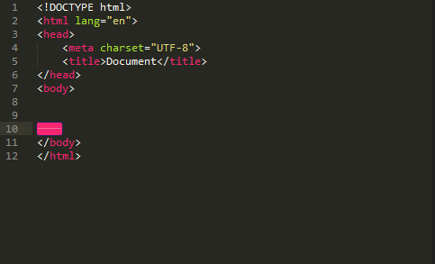
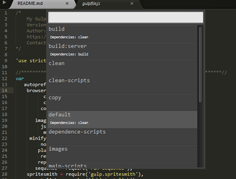
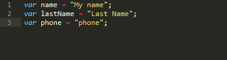
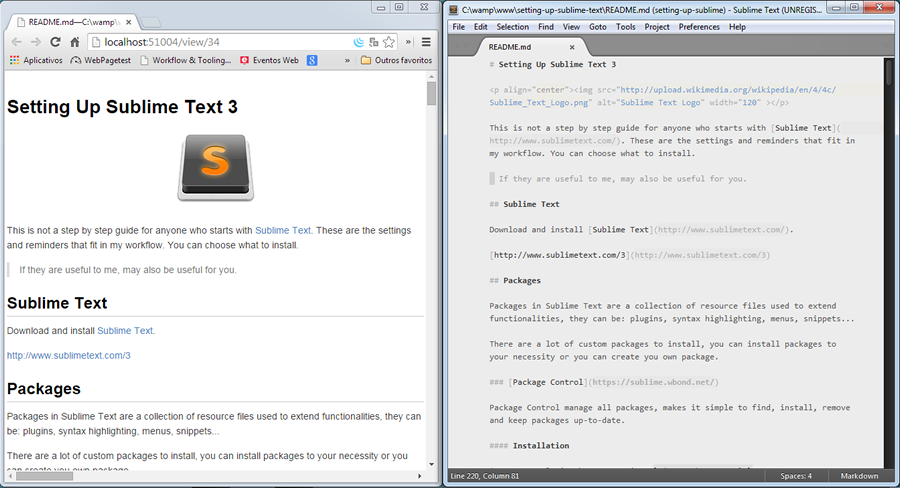

# Setting Up Sublime Text 3

<p align="center"></p>

This is not a step by step guide for anyone who starts with [Sublime Text](http://www.sublimetext.com/). These are the settings and reminders that fit in my workflow. You can choose what to install.

> If they are useful to me, may also be useful for you.

## Sublime Text

Download and install [Sublime Text 3](http://www.sublimetext.com/3).

## Table of Contents
* [Preferences](#preferences)
    * [Theme](#theme)
    * [Font](#font)
* [Key Bindings](#key-bindings)
    * [Reminders](#reminders)
* [Snippets](#snippets)
* [Packages](#packages)
* [Additional Languages Support](#additional-languages-support)
* [Working With Markdown](#working-with-markdown-)

## Preferences

> Sublime Text has many different settings to customize its behavior. Settings are changed by editing text files

You can set your preferences in `Preferences.sublime-settings`.

<!--
[Preferences.sublime-settings](https://raw.githubusercontent.com/tiagoporto/setting-up-sublime-text/master/Sublime%20Settings/Preferences.sublime-settings)
-->

### Theme

### Font

<!-- [Monaco](http://www.gringod.com/2006/11/01/new-version-of-monaco-font/)

http://input.fontbureau.com/download/index.html?size=11&wrap_lines=wrap&language=clike&theme=solarized-dark&family=InputMono&width=300&weight=400&line-height=1.4&a=ss&g=ss&i=serifs_round&l=serifs_round&zero=slash&asterisk=0&braces=straight&preset=monaco&customize=please
-->
## Key Bindings

All key bindings are configurable, you can change default key bindings or create new.

I have customized the following key bindings.

`Ctrl` `b` on Windows/Linux and `Super` `b` on OS X  = `<strong>selection</strong>`

`Ctrl` `i` on Windows/Linux and `Super` `i` on OS X = `<em>selection</em>`

`Ctrl` `u` on Windows/Linux and `Super` `u` on OS X = `<u>selection</u>`

### How to use

Download the file and save on the right folder

* [Default (Windows).sublime-keymap](https://raw.githubusercontent.com/tiagoporto/setting-up-sublime-text/master/Sublime%20Settings/Default%20(Windows).sublime-keymap) in the folder `C:\Users\{username}\AppData\Roaming\Sublime Text 3\Packages\User` on Windows.

* [Default (OSX).sublime-keymap](https://raw.githubusercontent.com/tiagoporto/setting-up-sublime-text/master/Sublime%20Settings/Default%20(OSX).sublime-keymap) in the folder `~/Library/Application Support/Sublime Text 3/Packages/User` in OS X.

* [Default (Linux).sublime-keymap](https://raw.githubusercontent.com/tiagoporto/setting-up-sublime-text/master/Sublime%20Settings/Default%20(Linux).sublime-keymap) in the folder `~/.config/sublime-text-3/Packages/User` in Linux.

### Reminders

If you're like me and always confused with a lot of key bindings, it's for us. A list of useful shortcuts.

#### Workspace

* `f11` = full screen
* `shift` `f11` = distract mode
* `alt` `shift` `2` = Layout in 2 columns
* `alt` `shift` `8` = Layout in 2 rows

#### Selection

* `Ctrl` `d` on Windows/Linux, or `Command` `d` on OS X = Quick Add Next.
* `Alt` `F3` on Windows/Linux, or `Ctrl` `Command` `g` on OS X = Find All
* `Ctrl` `Shift` `l` or `Command` `Shift` `l` on OS X = Splitting the Selection into Lines
* `Ctrl` `k`, `Ctrl` `d` on Windows/Linux, or `Command` `k` `Command` `d` on OS X = Quick Skip Next

    if you go too far, use Undo Selection (`Ctrl` `u`, or `Command` `u` on OS X) to step backwards

* `ctrl` `shift` `a` = Expand selection to tag

#### Utilities

* `ctrl` `k`, `ctrl` `v` = Paste History
* `ctrl` `shift` `t` = Reopen Closed Tab

## Snippets

> Snippets are smart templates that will insert text for you and adapt it to their context.

The snippets are triggered with the `tab` key after the snippet access string.

#### Example

When you write `jquery` and press `tab`, the Sublime Text identifies you need snippet `jQuery Fallback` and replaces the entire access sequence throughout the template. You can still edit some parts of the template by pressing `tab` to pass between the editable parts.



### [Comment Snippets](https://github.com/hachesilva/Comment-Snippets)

> Several snippets to create fancy PHP, CSS and HTML comments.


### How it works

[See the documentation](https://github.com/hachesilva/Comment-Snippets)

### My Snippets

If you want use some of this snippets, download the file and copy in your local folder:

* `C:\Users\{username}\AppData\Roaming\Sublime Text 3\Packages\User` in windows

* ` ~/Library/Application Support/Sublime Text 3/Packages/User` in OS X

* `~/.config/sublime-text-3/Packages/User` in Linux

#### [Readme](https://raw.githubusercontent.com/tiagoporto/setting-up-sublime-text/master/Snippets/Readme%20File.sublime-snippet)

* [Example of readme Snippet](https://github.com/tiagoporto/setting-up-sublime-text/blob/master/readme-snippet-example.md)

* To use write `readme` and press `tab`.

#### [Form Template](https://raw.githubusercontent.com/tiagoporto/setting-up-sublime-text/master/Snippets/Form%20Template.sublime-snippet)
* [Example of Form Template Snippet](https://github.com/tiagoporto/setting-up-sublime-text/blob/master/form-template-snippet-example.md)

* To use write `form:template` and press `tab`.


#### [Placehold.it](https://raw.githubusercontent.com/tiagoporto/setting-up-sublime-text/master/Snippets/Placehold%20it.sublime-snippet)

* To use write `phit` and press `tab`.

* Example

    ```html
    <!-- placehold.it package default image -->
    
    ```

#### [Project Header](https://raw.githubusercontent.com/tiagoporto/setting-up-sublime-text/master/Snippets/Project%20Header.sublime-snippet)

* Example

    ```css
    /*!
        Project Name
        Version: x.x.x
        Author: Name - Site
        Project Home page
        Contact: email
    \*/
    ```

* To use write `project-header` and press `tab`.


<!--
### Creating your own snippets

http://web-design-weekly.com/2012/07/03/snippets-in-sublime-text-2/
`ctrl` `shift` `alt` `p`
-->

## Packages

Packages in Sublime Text are a collection of resource files used to extend functionalities, they can be: plugins, syntax highlighting, menus, snippets...

There are a lot of custom packages to install, you can install packages to your necessity or you can create your own package.

### [Package Control](https://sublime.wbond.net/)

Package Control manage all packages, makes it simple to find, install, remove and keep packages up-to-date.

#### Installation

* Open Console in the menu options `View > Show Console`

* Paste the following code and execute

<code>import urllib.request,os,hashlib; h = '2deb499853c4371624f5a07e27c334aa' + 'bf8c4e67d14fb0525ba4f89698a6d7e1'; pf = 'Package Control.sublime-package'; ipp = sublime.installed_packages_path(); urllib.request.install_opener( urllib.request.build_opener( urllib.request.ProxyHandler()) ); by = urllib.request.urlopen( 'http://packagecontrol.io/' + pf.replace(' ', '%20')).read(); dh = hashlib.sha256(by).hexdigest(); print('Error validating download (got %s instead of %s), please try manual install' % (dh, h)) if dh != h else open(os.path.join( ipp, pf), 'wb' ).write(by)</code>

#### How to use

##### Installing packages

* `ctrl` `shift` `p`
* Type `install`
* Select `Package Control: Install Package`
* Search the package you want to install

##### Removing packages

* `ctrl` `shift` `p`
* Type `remove`
* Select `Package Control: Remove Package`
* Find the package you want to remove

### [SideBarEnhancements](https://github.com/titoBouzout/SideBarEnhancements)

Provides enhancements to the operations on Sidebar of Files and Folders, like: new file/folder, edit, open/run, reveal, find in selected/parent/project, cut, copy, paste, paste in parent, rename, move, delete, refresh...


### [AutoFileName](https://github.com/BoundInCode/AutoFileName)

Autocomplete filenames and paths in HTML and CSS.

#### How to use

* In the file press `ctrl` `space`


#### Inserting markdown and stylus in the scope

* Copy the file [autofilename.sublime-settings](https://raw.githubusercontent.com/tiagoporto/setting-up-sublime-text/master/Packages%20Settings/autofilename.sublime-settings) in the folder `C:\Users\{username}\AppData\Roaming\Sublime Text 3\Packages\User` in windows, ` ~/Library/Application Support/Sublime Text 3/Packages/User` in OS X or `~/.config/sublime-text-3/Packages/User` in Linux.

### [Tag](https://github.com/SublimeText/Tag)

Provides utilities to work with tags in HTML/XML: "Close tag on slash", "Tag indent or AutoFormat Tags", "Tag Remove", "Insert as Tag", "Tag Remove Attributes", "Tag Close", "Tag Lint"

#### How to use

* See the documentation: [https://github.com/SublimeText/Tag](https://github.com/SublimeText/Tag)

### [Bracket Highlighter](https://github.com/facelessuser/BracketHighlighter)

Finds and highlights matching brackets such as: [], (), {}, "", '', <tag></tag>, and even custom brackets.


### [Trailing Spaces](https://github.com/SublimeText/TrailingSpaces)

Highlight trailing spaces and delete them in a flash!


#### Setting Trim On Save

* Copy the file [trailing_spaces.sublime-settings](https://raw.githubusercontent.com/tiagoporto/setting-up-sublime-text/master/Packages%20Settings/trailing_spaces.sublime-settings) in the folder
    * `C:\Users\{username}\AppData\Roaming\Sublime Text 3\Packages\User` in windows
    * ` ~/Library/Application Support/Sublime Text 3` in OS X.


###  [Emmet](http://emmet.io/)

Emmet is the most essential plugin for web-developers, it helps you write HTML and CSS code easily, expanding simple abbreviations into complex code snippets.


* Watch the demo in [http://emmet.io/](http://emmet.io/)
* Read this great tutorial: [Goodbye, Zen Coding. Hello, Emmet!](http://www.smashingmagazine.com/2013/03/26/goodbye-zen-coding-hello-emmet/)
* Learn the syntax in [Cheat Sheet](http://docs.emmet.io/cheat-sheet/)

### [Color Picker](http://weslly.github.io/ColorPicker/)

Open a Color Picker in Sublime Text.


#### How to use

* `ctrl` `shift` `c` on Windows or `command` `shift` `c` on OS X

### [ColorHighlighter](https://github.com/Monnoroch/ColorHighlighter)

Live Preview of color values in Stylesheets.


#### Tip

The key bindings that plugin, use some of the same useful standards key bindins of the Sublime Text , I usually disable them

* Menu Option `tools -> color highlighter -> Disable default keybindings`

### [DocBlockr](https://github.com/spadgos/sublime-jsdocs)

Good plugin to help write documentation in __JavaScript__, __PHP__, __CofeeScript__, ...


### How to use

* Press enter or tab after `/**` (or `###*` for Coffee-Script).

### [Clickable Urls](https://github.com/leonid-shevtsov/ClickableUrls_SublimeText)

> Underlines URLs in Sublime Text, and lets you open them with a keystroke.

### How to use

* Put the cursor over an URL and press `Cmd` `Option` `Enter` or `Ctrl` `Alt` `Enter`

This key binding cause conflict with default sublime key bindings, I switched to `Ctrl` `Alt` `Shift` `Enter`

###  [EditorConfig](http://editorconfig.org/)

> EditorConfig helps developers define and maintain consistent coding styles between different editors and IDEs. The EditorConfig project consists of __a file format__ for defining coding styles and a collection of __text editor plugins__ that enable editors to read the file format and adhere to defined styles.

### How to use

* See the documentation: [EditorConfig Page](http://editorconfig.org/)

### [SFTP](http://wbond.net/sublime_packages/sftp)

FTP, FTPS and SFTP support for Sublime Text.


#### How to use

* Read the [instructions](http://wbond.net/sublime_packages/sftp/usage).

### [Can I Use](https://github.com/Azd325/sublime-text-caniuse)

Useful for quick check CSS property support on the [Can I Use site](http://caniuse.com/).

#### How to use

* Mark or place your cursor over a CSS property and press `ctrl` `alt` `f`.

###  [gulp](https://github.com/NicoSantangelo/sublime-gulp)

> A Gulp task runner with snippets.

#### How to use

> It's necessary a `gulpfile.js` in the open folder to run tasks.

* `ctrl` `shift` `p`
* Type `gulp`
* Select the task to run



See the documentation on [sublime-gulp](https://github.com/NicoSantangelo/sublime-gulp) to snippets.

### [Alignment](https://github.com/wbond/sublime_alignment)

> A simple key-binding for aligning multi-line and multiple selections.



#### How to use

* `ctrl` `alt` `a`

### [ CSS Comb](http://csscomb.com/)

Coding style formatter for CSS.

#### How to use

* `ctrl` `shift` `c`

### [SublimeLinter](http://www.sublimelinter.com/)

### [Terminal](https://github.com/wbond/sublime_terminal)

> Launch terminals from the current file or the root project folder.

#### How to use

* `ctrl` `alt` `shift` `t` - Open Terminal at Project Folder

* `alt` `shift` `t` - Open Terminal at File

The default key binding is `ctrl` `shift` `t`, the same of the default sublime reopen closed tab, I changed.

* Copy the file
    * [Default (Windows).sublime-keymap](https://raw.githubusercontent.com/tiagoporto/setting-up-sublime-text/master/Packages%20Settings/Terminal/Default%20(Windows).sublime-keymap) in the folder `C:\Users\{username}\AppData\Roaming\Sublime Text 3\Packages\Terminal` in windows

    * [Default (OSX).sublime-keymap](https://raw.githubusercontent.com/tiagoporto/setting-up-sublime-text/master/Packages%20Settings/Terminal/Default%20(OSX).sublime-keymap) in the folder `~/Library/Application Support/Sublime Text 3/Packages/Terminal` in OS X

    * [Default (Linux).sublime-keymap](https://raw.githubusercontent.com/tiagoporto/setting-up-sublime-text/master/Packages%20Settings/Terminal/Default%20(Linux).sublime-keymap) in the folder `~/.config/sublime-text-3/Packages/Terminal` in Linux

### [](https://github.com/Cacodaimon/GhostText-for-SublimeText)

> Allows live editing of Chrome text area or JS Code editor content with Sublime Text.


#### Addition Installation

- [Chrome Extension](https://chrome.google.com/webstore/detail/ghosttext-for-chrome/godiecgffnchndlihlpaajjcplehddca?utm_source=chrome-ntp-icon)

#### How to use

* In Chrome, click the GhostText button in the upper-right corner to open up Sublime Text.

## Additional Languages Support

Sublime Text has support for multiple languages, that aren't supported by default it's possible to be added with packages.

[JavaScript Completions](https://github.com/pichillilorenzo/JavaScript-Completions)

This package adds autocompletion for JavaScript codes.


[PHP Completions Kit](https://github.com/gerardroche/sublime-phpck)

Adds autocompletion for PHP codes.

### [](https://github.com/danro/LESS-sublime)

Provides syntax highlighting for less.

### [](https://sublime.wbond.net/packages/Sass)

Provides syntax highlighting and tab/code completion for Sass and SCSS files.

### [](https://github.com/billymoon/Stylus)

> Includes build system and syntax highlighting for stylus CSS preprocessor.

#### Addition package

* [Stylus-Snippets](https://github.com/billymoon/Stylus-Snippets)

    This package complements [Stylus Package](https://github.com/billymoon/Stylus) includes Stylus Snippets, and allow dynamic expansion of CSS properties (use with Stylus plugin instead of emmet).

### [](https://github.com/SublimeText/jQuery)

Provides syntax highlighting for jquery and snippets with methods.

### [](https://github.com/angular-ui/AngularJS-sublime-package)

Code completion, snippets, syntax file `HTML (Angular.js)` and more.

###  [Apache Conf](https://github.com/colinta/ApacheConf.tmLanguage)

Syntax Highlighting for .conf, .htaccess, .htgroups and .htpasswd

### [ Blade](https://github.com/Medalink/laravel-blade)

Syntax definitions for the Laravel Blade engine.

### [Robots](https://github.com/andriyko/sublime-robot-framework-assistant)

Provides some features for working with Robot Framework (.txt and .robot), like: Syntax highlighting, autocomplete and more.

## Working with Markdown 

There are softwares ([Mou](http://25.io/mou/), [Atom](https://atom.io/) and [Brackets](http://blog.brackets.io/2013/04/23/markdown-extension-for-brackets/)) that have a live preview when editing markdown. The Sublime Text doesn't have this feature, even with plugins, the closest to this was using these plugins.

### [MarkdownEditing](https://github.com/SublimeText-Markdown/MarkdownEditing)

Powerful Markdown package with syntax highlighter, snippets and themes.


#### How to use

* See the documentation: [MarkdownEditing Page](https://github.com/SublimeText-Markdown/MarkdownEditing/blob/master/README.md)

### [OmniMarkupPreviewer](https://github.com/timonwong/OmniMarkupPreviewer)

Plugin to live preview markup files.



#### How to use

* Open the markdown file
* `ctrl` `shift` `p`
* Select `OmniMarkupPreviewer: Preview Current Markup in Browser`

<!--
http://code.tutsplus.com/courses/perfect-workflow-in-sublime-text-2/lessons/your-first-snippet
https://realpython.com/blog/python/setting-up-sublime-text-3-for-full-stack-python-development/
http://tableless.com.br/dicas-truques-sublime-text/?utm_content=buffer5dd8f&utm_medium=social&utm_source=facebook.com&utm_campaign=buffer
 -->